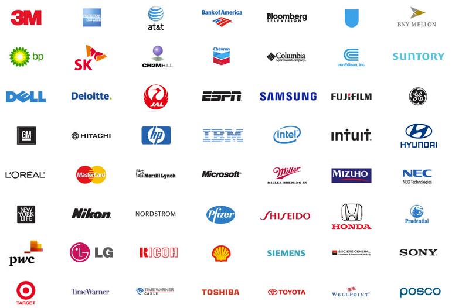
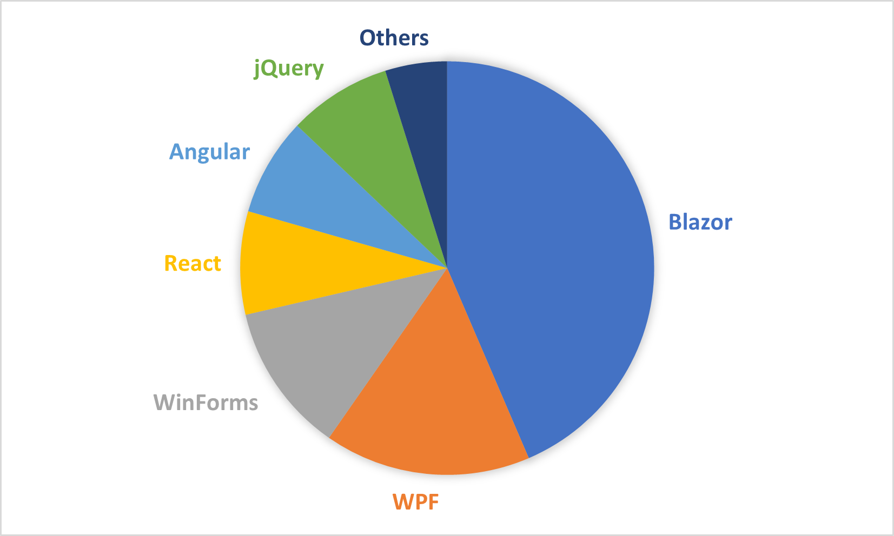
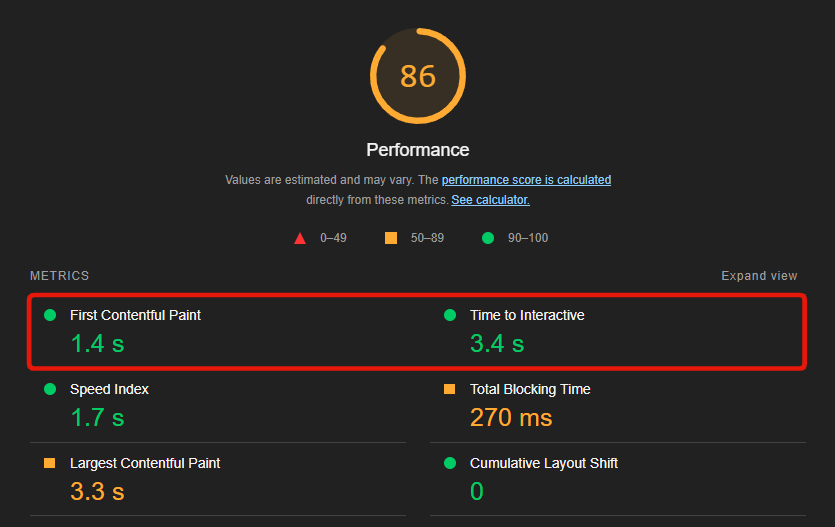
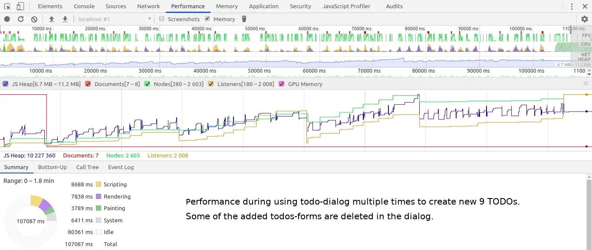
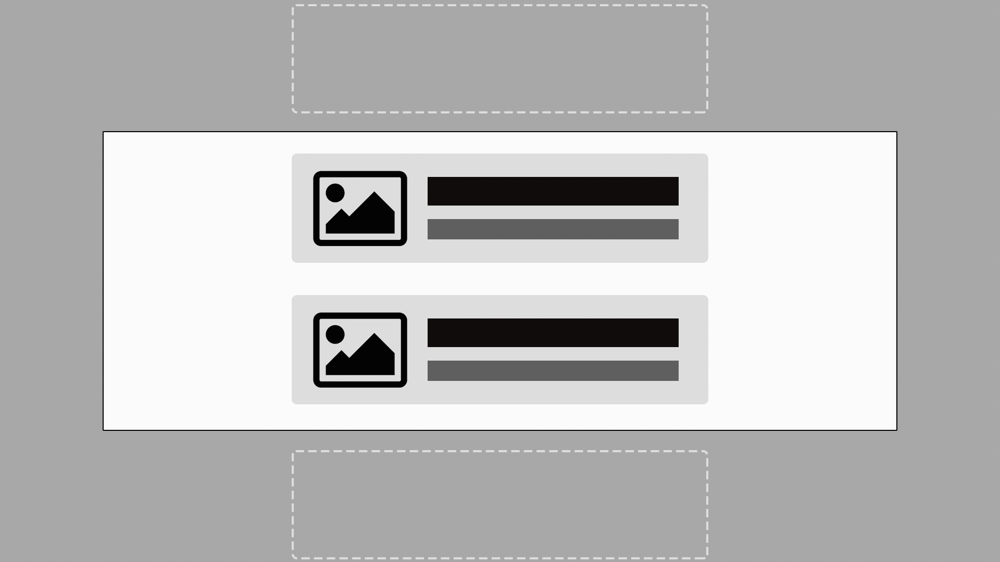
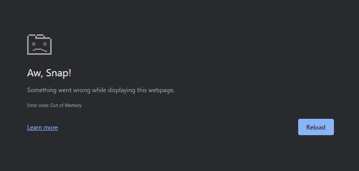
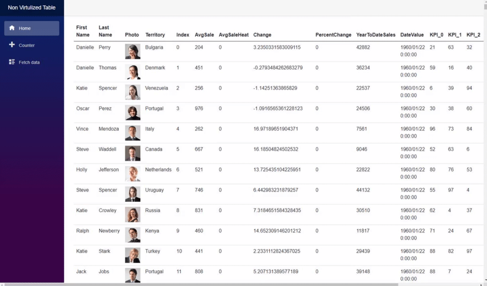
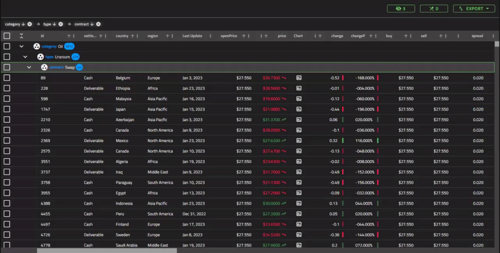

# **.NET Conf 2023 <br>x Seoul**

Let's start developing Blazor applications with "high performance" tuning!

---

# Self Introduction

**Motoki Nakae**


Solutions Consultant at Infragistics.
I am solving customers’ UI/UX problems with our knowledge and products, especially about web applications every day.
Also known as a "dog lover".

 <small>MNakae@infragistics.com</small>, <small>ESEA@infragistics.com</small>
 <small>@Kashikoinu</small>

<style scoped>
* {
    vertical-align:middle
}
</style>

---

<div style="text-align:center; margin:0; line-height:1">


</div>

<div style="display:flex; width:102%; justify-content: space-around; text-align:center; margin-top:-50px; margin-left: -2.4%">

<div>

### Ken Azuma

CEO at Infragstics JAPAN

</div>

<div>

### Dongsu Jo

Sales Manager, ESEA

</div>

</div>

---

# Infragistics

<div style="text-align:center">


</div>
We Infragistics provides well designed and high functional UI controls and components for developers over 30 years.

---



---

# <!-- fit -->246
<style scoped>
* {
    text-align:center;
    line-height:1
}
h1 {
    height:530px;
    margin-top:-50px
}
</style>
### meetings with customer in 2022

---



---

# What's happening in Japan

<small>

## Demand of Blazor was much increased 2022

</small>

One of common scenario:

- The developer works for implementing desktop application for the system inside a plant.
- They are facing new request that about monitoring system to see a status of plant operation for managers.
- Since the manager have to move around a lot during the job, they want a web application to access from anywhere.
- Performance is important.

<style scoped>
li {
    font-size:90%;
}
</style>

---

# Today's Topics

- The reason why I recommend you Blazor as the web development framework.
- The points you should take care for web application as performance perspective.
- Let's start to create a new Blazor web application with performance tuning.
- What if more complex functional UI components are needed.

---

# Why you should choice Blazor

- You are C# developer.
- You are familiar with Blazor Server. (similar to client server model)
- You can create latest SPA web application.
- Document and showcase are incresing day by day.
- Microsoft is investing a lot to Blazor.
- A lot of library vendors were adopted Blazor including Infragistics.

---

# Time to start Blazor!


<style scoped>
h1 {
    text-align:center;
    padding-top:3.95em;
}
</style>

---

# <!-- fit -->Web application performance
<style scoped>
* {
    text-align:center;
    padding-top:3.75em;
}
</style>

---

# <!-- fit -->Three dimensions of web app performance

<small>

## 1. Load Time Performance

</small>

- How fast the web application load.
- For a desktop app, the time to excute application and be able to start interaction for user.
- To measure this performance, I suggest your use the "Lighthouse" (Chrome Extension).
- You should check "First Contentful Paint" metrics firstly.

---


<style scoped>
* {
    text-align:center;
    vertical-align:center;
    padding-top:14px;
}
</style>
---

# To reduce the Load Time

<table>
    <thead>
        <tr>
            <th></th>
            <th>Tips</th>
            <th>Sample Result</th>
        </tr>
    </thead>
    <tbody>
        <tr>
            <th>Blazor Server</th>
            <td>Basically, you don't have to care.</td>
            <td>-</td>
        </tr>
        <tr>
            <th rowspan="4">Blazor WebAssembly</th>
            <td>Use Brotli to compress files.(<a href="https://learn.microsoft.com/en-us/aspnet/core/blazor/host-and-deploy/webassembly?view=aspnetcore-7.0#customize-how-boot-resources-are-loaded">document</a>)</td>
            <td><b style="color:blue">-80%</b></td>
        </tr>
        <tr>
            <td>Turn on IL trimming to reduce the size of published output.(<a href="https://learn.microsoft.com/en-us/aspnet/core/blazor/host-and-deploy/configure-trimmer?view=aspnetcore-7.0">document</a>)</td>
            <td><b style="color:blue">-44%</b></td>
        </tr>
        <tr>
            <td>Installing a wasm-tools.(<a href="https://devblogs.microsoft.com/dotnet/asp-net-core-updates-in-net-6-rc-2/#native-dependencies-support-for-blazor-webassembly-apps">document</a>)</td>
            <td><b style="color:blue">-7%</b></td>
        </tr>
        <tr>
            <td>If possible, cut the globalization and TimeZone capability.(document <a href="https://learn.microsoft.com/en-us/aspnet/core/blazor/performance?view=aspnetcore-7.0#minimize-app-download-size">1</a> / <a href="https://learn.microsoft.com/en-us/dotnet/core/runtime-config/globalization">2</a>)</td>
            <td><b style="color:blue">-37%</b></td>
        </tr>
    </tbody>
</table>

<style scoped>
table {
    font-size:30px;
}
</style>

---

# <!-- fit -->Three points of web app performance

<small>

## 2. Run Time Performance

</small>

- How responsive the web app is to user interactions.
- Chrome developer tools is good to identify performance bottlenecks.
- Some guidelines to improve run time performance:

    - Less than 1500 nodes in total. The maximum depth is 32 nodes. No parent node has more than 60 child nodes.
    - Properly size images, and lazy load images.

---

# Chrome developer tools

<div style="text-align:center">



</div>

<style scoped>
div {
    text-align:center;
}
</style>

---

# <!-- fit -->Three points of web app performance

<small>

## 2. Run Time Performance

</small>

- How responsive the web app is to user interactions.
- Chrome developer tools is good to identify performance bottlenecks.
- Some guidelines to improve run time performance:

    - Less than 1500 nodes in total. The maximum depth is 32 nodes. No parent node has more than 60 child nodes.
    - Properly size images, and lazy load images.

---

# <!-- fit -->Three points of web app performance

<small>

## 3. Soft Performance

</small>

This dimension is not easy to talk, hard to measure, this is related to User Experience for example:

- How easy it is for your user to find and navigate to the feature they want to use.
- How appealing the look and feel of your application is.
- How good the error messages your software produces to understand what the end user did wrong.

---

# <!-- fit -->Tips of Web application performance
<style scoped>
* {
    text-align:center;
    padding-top:3.75em;
}
</style>

---

# Component Virtualization

Virtualization is a technique for limiting UI rendering to just the parts that are currently visible.

- You can use this technique for huge amount of looping content, like list, card, table.
- With calculating the position of scroll, just rendering necessary DOM inside a viewable area.
- When rendered DOM go outside from viewable area, it going to be destroyed.
- This is an out-of-the-box function for Blazor.

---



---

# <!-- fit -->Let's make virtulized table with 10k items

```html
<table>
    ...
        @foreach (var item in Items)
            <tr>
                <td>@item.FirstName</td>
                <td>@item.LastName</td>
                ...
        }
```

```html
...
        <Virtualize Items="@Items" Context="item">
            <tr>
                <td>@item.FirstName</td>
                <td>@item.LastName</td>
                ...
        </Virtualize>
```

<style scoped>
code {
    font-size: 60%;
}
</style>

---

# What happens if you don't virtulize?

<small>

## With 10k items

</small>

<div>



</div>

<style scoped>
div {
    text-align:center;
}
</style>

---

<small>

## With 2.5k items

</small>



<style scoped>
h2 {
    color:#fff;
    background: rgba(0,0,0,.5);
    display: inline-block;
    padding: .3em
}
</style>

---

# Let's look at the result of virtulization
<style scoped>
* {
    text-align:center;
    padding-top:3.75em;
}
</style>

---


---


---

# <!-- fit -->You need more complex functional UI?
<style scoped>
* {
    text-align:center;
    padding-top:3.75em;
}
</style>

---

# To keep both functionality and performance is so difficult

- Feature request that never ends.

    - Sorting, Filtering, To register the short cut and so on.

- The difficulty of performance tuning increase for functional UI cotrols.
- Too hard to navigate the end user to each feature, easily produce bad user experience.

---



<!--
_backgroundColor: #202020
-->

---

# What we have done for customer in Japan.

- Supported them to adopt Blazor as blandnew framework.
- Provided the training video to learn Blazor for biginner.
- Solved their UI requirements trough our controls.
- Provided consultation service.


---

# Takeaway

<style scoped>
div {
    font-size: 120%;
    line-height:1.6
}
li {
    margin-bottom:1em
}
</style>

<div>

- You don't need to hesitate to Blazor now, let's try to start!
- Handle three kind of dimensions for performance!
- If complex UI is require, rely on professional like Infragistics!

</div>